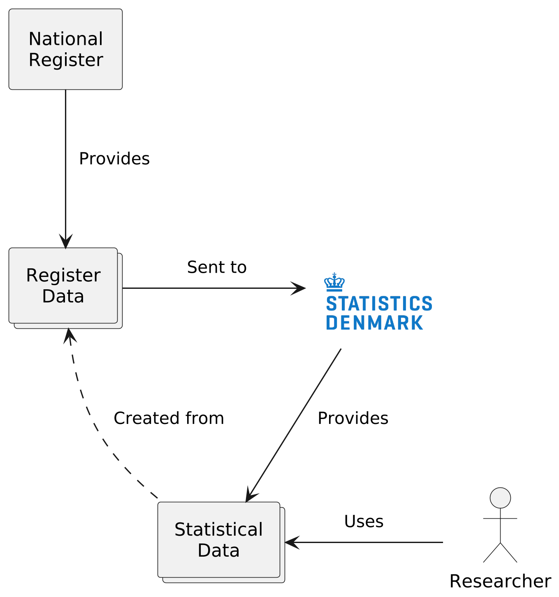
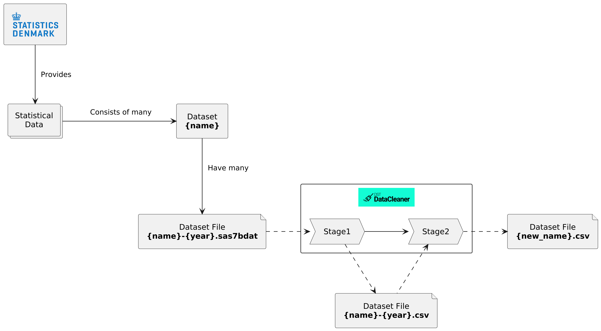

 

  

  

    <strong>Dst-data-cleaner is a <a href="https://www.nextflow.io/">Nextflow</a> pipeline that cleans datasets provided by <a href="https://www.dst.dk/en/">Statistics Denmark</a></strong>
  

The goal of this pipeline is facilitate register based research by producing data that is:

- Easy to work with
- Prepared for downstream pipeline usage
- Not tied to proprietary tooling

## How it works ⚙️

In Denmark there are around **40** nation registers that keep track of various aspects of Danish society. These
registers provides "register data" for different governmental organizations, where `dst` is one of those
organizations. In turn `dst` provides "statistical data" for research organizations, that is has compiled
from the register data it received from the national registers.

The statistical data that `dst` provides are made up of around
[**400** distinct datasets](https://danmarksdatavindue.dk/DDVDatasafari/#/registers).
Each dataset has a unique name and is provided as a set of "dataset files" in the proprietary
format `.sas7bdat`. Each dataset file represents a single year and holds the data produced in that year
(expect for small datasets, they only have one file with all data).

Here's where the pipeline `dst-data-cleaner` comes into the picture. It processes the data in 2 stages:

- **Stage 1**:
    - Convert `.sas7bdat` files into `.csv` files
    - Exclude irrelevant columns
- **Stage 2**:
    - Create new opinionated datasets by manipulating and combining related datasets

**Stage1** of the pipeline is only about picking out what data to clean and changing the storage
format of the data. The actual data is not manipulated in any way.

**Stage2** of the pipeline is where decisions are taken that can affect research results. The data is
manipulated and related datasets are merged together to form new datasets.

By keeping the files produced in both stages, researchers can either use the opinionated datasets
that are easier to work with, or if they are doing their own custom cleaning, they can use the unchanged
datasets.

## Project overview 👀

TBD

## Quick Start 🚀

TBD

## Support 💬

If you have any questions, suggestions, or need assistance, please open a GitHub issue.
