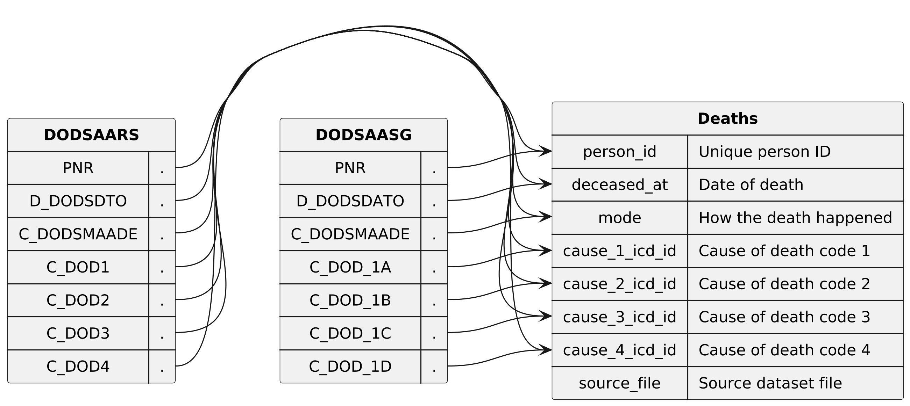

* Dataset `deaths`

Contains each death registered in the CPR system, along with the cause, date and mode.

** Columns

|   index | name             | description                                                                                          |
|---------+------------------+------------------------------------------------------------------------------------------------------|
|       0 | `person_id`      | Unique (population wide) ID of the person, which is an anonymized version of the persons CPR number. |
|       1 | `deceased_at`    | Date when the person died                                                                            |
|       2 | `mode`           | How the death happened (natural, accident, murder, suicide, etc.)                                    |
|       3 | `cause_1_icd_id` | ICD-code of the primary cause of death                                                               |
|       4 | `cause_2_icd_id` | ICD-code of the secondary cause of death                                                             |
|       5 | `cause_3_icd_id` | ICD-code of the tertiary cause of death                                                              |
|       6 | `cause_4_icd_id` | ICD-code of the quaternary cause of death                                                            |
|       7 | `source_file`    | File that the row originates from                                                                    |

  