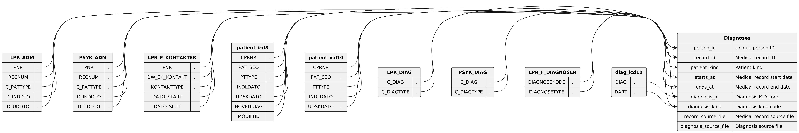

* Dataset ~diagnoses~

Contains every diagnosis found in NPR and PCRR in the period 1986-11-05 to 2026-03-02.

** Columns

|   index | name                    | description                                                                                                                     |
|---------+-------------------------+---------------------------------------------------------------------------------------------------------------------------------|
|       0 | ~person_id~             | Unique (population wide) ID of the person, which is an anonymized version of the persons CPR number.                            |
|       1 | ~record_id~             | Unique (register wide) ID of the medical record which the diagnosis belongs to                                                  |
|       2 | ~patient_kind~          | Code for the kind of patient the medical record was created as. Note that different codes were used by the different registers. |
|       3 | ~starts_at~             | Starting date of medical record                                                                                                 |
|       4 | ~ends_at~               | Ending date of medical record                                                                                                   |
|       5 | ~diagnosis_id~          | SKS-code (D-code) or ICD-8 code for the diagnosis                                                                               |
|       6 | ~diagnosis_kind~        | Code for the kind of diagnosis made. Note that different codes were used by the different registers.                            |
|       7 | ~record_source_file~    | Name of the dataset file that the medical record data of this row originates from.                                              |
|       8 | ~diagnosis_source_file~ | Name of the dataset file that the diagnosis data of this row originates from.                                                   |

  