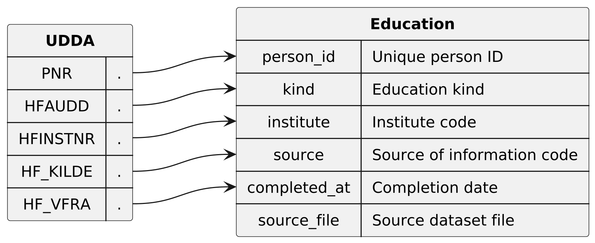

* Dataset ~education~

Contains every highest education that has been obtained in the period 1994-01-30 to 2026-02-22.
Each persion can appear multiple times in this dataset, as their highest education is
updated everytime they complete an education program that gives a higher credential
than their previous highest education.

** Columns

|   index | name           | description                                                                                          |
|---------+----------------+------------------------------------------------------------------------------------------------------|
|       0 | ~person_id~    | Unique (population wide) ID of the person, which is an anonymized version of the persons CPR number. |
|       1 | ~kind~         | Code that describes the kind of education that was completed. There are 3510 distinct codes.         |
|       2 | ~institute~    | Code of the institute where the education was completed. There are 9330 distinct codes.              |
|       3 | ~source~       | Code that classifies the source of the education information. There 19 distinct codes.               |
|       4 | ~completed_at~ | The date when the education was completed.                                                           |
|       5 | ~source_file~  | Name of the dataset file that this row originates from.                                              |

  