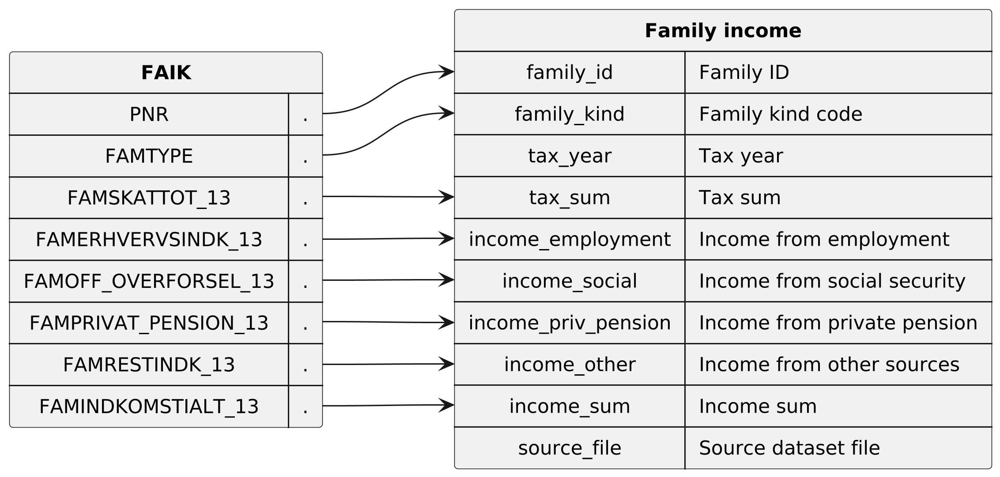

* Dataset `family_income`

Contains the yearly income and taxes for family in the population. This means that each family will appear once for every tax year. Contains tax years 1985 to 2020

** Columns

|   index | name                  | description                                                                          |
|---------+-----------------------+--------------------------------------------------------------------------------------|
|       0 | `family_id`           | Unique (population wide) ID of the family.                                           |
|       1 | `family_kind`         | Code that represents the kind of family.                                             |
|       2 | `tax_year`            | The year that the income and taxes are for.                                          |
|       3 | `tax_sum`             | The total sum of taxes payed by the family for the tax year.                         |
|       4 | `income_employment`   | Total income derived from employment                                                 |
|       5 | `income_social`       | Total income derived from social security                                            |
|       6 | `income_priv_pension` | Total income derived from private pension                                            |
|       7 | `income_other`        | Total income derived from other sources than employment, social and private pension. |
|       8 | `income_sum`          | Total income from all income sources.                                                |
|       9 | `source_file`         | Name of the dataset file that this row originates from.                              |

  