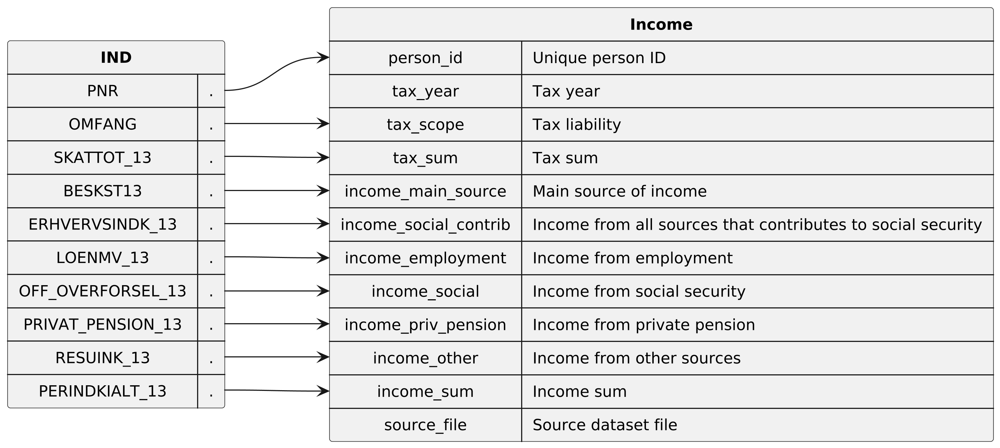

* Dataset ~income~

Contains the yearly income and taxes for each person in the population. This means that each person will appear once for every tax year. Contains tax years 1985 to 2020

** Columns

|   index | name                  | description                                                                                                                                                                                                                                                                                                                                              |
|---------+-----------------------+----------------------------------------------------------------------------------------------------------------------------------------------------------------------------------------------------------------------------------------------------------------------------------------------------------------------------------------------------------|
|       0 | ~person_id~           | Unique (population wide) ID of the person, which is an anonymized version of the persons CPR number.                                                                                                                                                                                                                                                     |
|       1 | ~tax_year~            | The year that the income and taxes are for.                                                                                                                                                                                                                                                                                                              |
|       2 | ~tax_scope~           | A code that represents the scope of the persons tax liability. For example, if you are employed and living in Denmark you have full tax liability. If you live abroad but work in Denmark occasionally, you might have reduced tax liability. Tax liability is connected to how much a person benefits from social security. There are 7 distinct codes. |
|       3 | ~tax_sum~             | The total sum of taxes payed by the person for the tax year.                                                                                                                                                                                                                                                                                             |
|       4 | ~income_main_source~  | A code that represents the persons main source of income. For example, if the person was employed, was on benefits or was retired. There are 13 codes.                                                                                                                                                                                                   |
|       5 | ~income_employment~   | Total income derived from employment                                                                                                                                                                                                                                                                                                                     |
|       6 | ~income_social~       | Total income derived from social security                                                                                                                                                                                                                                                                                                                |
|       7 | ~income_priv_pension~ | Total income derived from private pension                                                                                                                                                                                                                                                                                                                |
|       8 | ~income_other~        | Total income derived from other sources than employment, social and private pension.                                                                                                                                                                                                                                                                     |
|       9 | ~income_sum~          | Total income from all income sources.                                                                                                                                                                                                                                                                                                                    |
|      10 | ~source_file~         | Name of the dataset file that this row originates from.                                                                                                                                                                                                                                                                                                  |

  