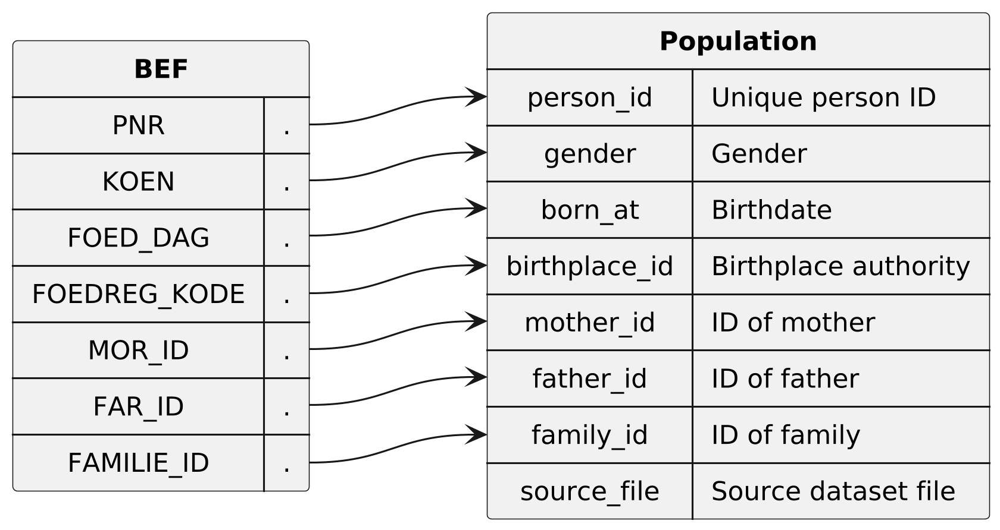

* Dataset ~population~

Contains every person registered in the Danish Civil Registration System in the period 1986-06-24 to 2026-01-05.
Every person appears once in this dataset, with an unique value in the `person_id` column.

** Columns

|   index | name            | description                                                                                          |
|---------+-----------------+------------------------------------------------------------------------------------------------------|
|       0 | ~person_id~     | Unique (population wide) ID of the person, which is an anonymized version of the persons CPR number. |
|       1 | ~gender~        | Legal gender of the person                                                                           |
|       2 | ~born_at~       | Birthdate of person, in the format YYYY-MM-DD.                                                       |
|       3 | ~birthplace_id~ | ID of the authority that registered the persons birth.                                               |
|       4 | ~mother_id~     | ID of the persons mother (legal, not biological)                                                     |
|       5 | ~father_id~     | ID of the persons father (legal, not biological)                                                     |
|       6 | ~family_id~     | ID of the family that the person belongs to                                                          |
|       7 | ~source_file~   | Name of the dataset file that this row originates from                                               |

  